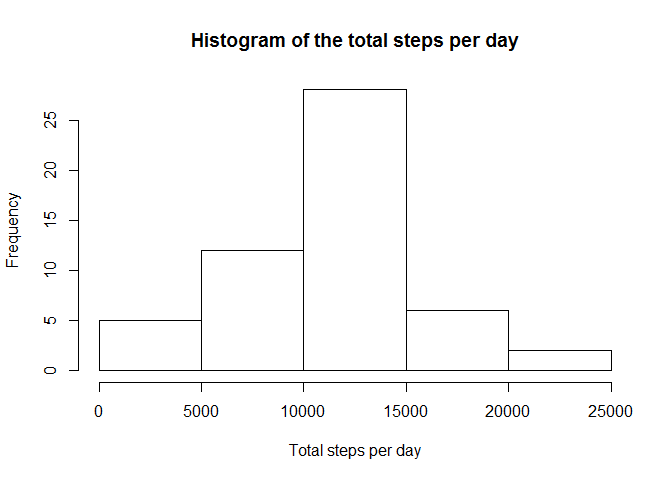
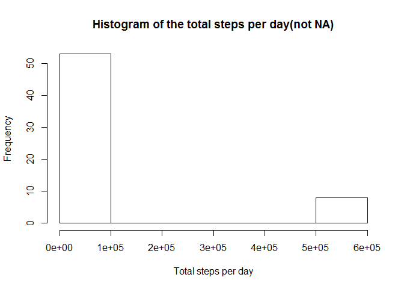
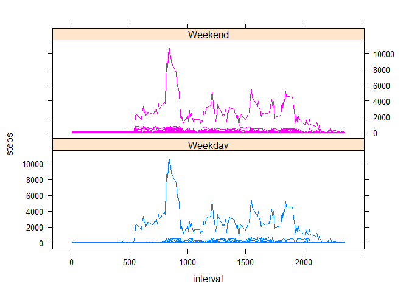

# Reproducible Research: Peer Assessment 1


## Loading and preprocessing the data

```r
library(lubridate)
library(timeDate)
library(lattice)
library(sqldf)
```

```
## Loading required package: gsubfn
## Loading required package: proto
## Loading required package: RSQLite
## Loading required package: DBI
```

```r
library(dplyr)
```

```
## 
## Attaching package: 'dplyr'
## 
## The following objects are masked from 'package:lubridate':
## 
##     intersect, setdiff, union
## 
## The following object is masked from 'package:stats':
## 
##     filter
## 
## The following objects are masked from 'package:base':
## 
##     intersect, setdiff, setequal, union
```

```r
rawdata <- read.csv("activity.csv")
rawdata$date <- as.Date(rawdata$date,"%Y-%m-%d")  
```

## What is mean total number of steps taken per day?


```r
#1. The total number of steps taken per day
sumperday <- sqldf(" select date, sum(steps) AS totalsteps
                                from rawdata
                                where steps is not null
                                group by date
                       
                       ",stringsAsFactors = FALSE
)
```

```
## Loading required package: tcltk
```


```r
#2. Make a histogram of the total number of steps taken each day
hist(sumperday$totalsteps, xlab= 'Total steps per day', main='Histogram of the total steps per day')
```

 


```r
#3. Calculate and report the mean and median of the total number of steps taken per day
mean(sumperday$totalsteps)
```

```
## [1] 10766.19
```

```r
median(sumperday$totalsteps)
```

```
## [1] 10765
```

## What is the average daily activity pattern?


```r
#1. Make a time series plot (i.e. type = "l") of the 5-minute interval (x-axis) and the average number of steps taken, #averaged across all days (y-axis)
meanperinterval <- sqldf(" select interval, AVG(steps) AS averagesteps
                                from rawdata
                                where steps is not null
                                group by interval
                       
                       ",stringsAsFactors = FALSE
)

plot(meanperinterval, type="l")
```

 


```r
#2. Which 5-minute interval, on average across all the days in the dataset, contains the maximum number of steps?
maximumsteps <- max(meanperinterval$averagesteps)
filter(meanperinterval,meanperinterval$averagesteps ==  maximumsteps)
```

```
##   interval averagesteps
## 1      835     206.1698
```
## Imputing missing values


```r
# Note that there are a number of days/intervals where there are 
# missing values (coded as NA). The presence of missing days may introduce bias into some calculations or summaries of the data.

# 1. Calculate and report the total number of missing values in the dataset (i.e. the total number of rows with NAs)
numberofmissingrows <- filter(rawdata, is.na(steps))
nrow(numberofmissingrows)
```

```
## [1] 2304
```


```r
# 2. Devise a strategy for filling in all of the missing values in the dataset. 
#    The strategy does not need to be sophisticated. For example, you could use the mean/median for that day, or the mean #    for that 5-minute interval, etc.
#
#    The missing values will be filled in with the mean of the for that 5-minute interval

# 3.Create a new dataset that is equal to the original dataset but with the missing data filled in.
datawithnomissingvalues <- sqldf(" 
                        select 
                             CASE WHEN f.steps is null then  a.totalsteps
                                  ELSE f.steps
                             END AS steps
                            ,f.date
                            ,f.interval
                         
                        
                         from rawdata as f
                          left join
                              (
                                select interval, SUM(steps) AS totalsteps
                                from rawdata
                                where steps is not null
                                group by interval
                              ) as a ON a.interval = f.interval
                       
                       ",stringsAsFactors = FALSE
)
```
 

```r
# 4.Make a histogram of the total number of steps taken each day and Calculate and report the mean and median 
#   total number of steps taken per day.
sumperdaynotna <- sqldf(" select date, sum(steps) AS totalsteps
                                from datawithnomissingvalues
                                group by date
                       
                       ",stringsAsFactors = FALSE
)

hist(sumperdaynotna$totalsteps, xlab= 'Total steps per day', main='Histogram of the total steps per day(not NA)')
```

 

```r
mean(sumperdaynotna$totalsteps)
```

```
## [1] 84188.07
```

```r
median(sumperdaynotna$totalsteps)
```

```
## [1] 11458
```


```r
#  Do these values differ from the estimates from the first part of the assignment? 
#  What is the impact of imputing missing data on the estimates of the total daily number of steps?
#
#  The values differ from the estimates from the first part of the assigment
#  The impact of imputing missing data on the estimates of the total daily number of steps is that the dataset
#  is not represtative anymore for the same calculation/histogram, e.i. you should not sum it first.


## Are there differences in activity patterns between weekdays and weekends?
#For this part the weekdays() function may be of some help here. Use the dataset with the filled-in missing values for this part.

# 1. Create a new factor variable in the dataset with two levels - "weekday" and "weekend" 
#    indicating whether a given date is a weekday or weekend day.

datawithnomissingvalues$weekend <- as.factor(ifelse(isWeekend(datawithnomissingvalues$date),'Weekday','Weekend'))
```


```r
# 2. Make a panel plot containing a time series plot (i.e. type = "l") of the 5-minute interval (x-axis) 
#    and the average number of steps taken, averaged across all weekday days or weekend days (y-axis). 
xyplot(steps ~ interval |  weekend ,groups = weekend  ,data = datawithnomissingvalues, layout = c(1, 2), type = 'l')
```

 

